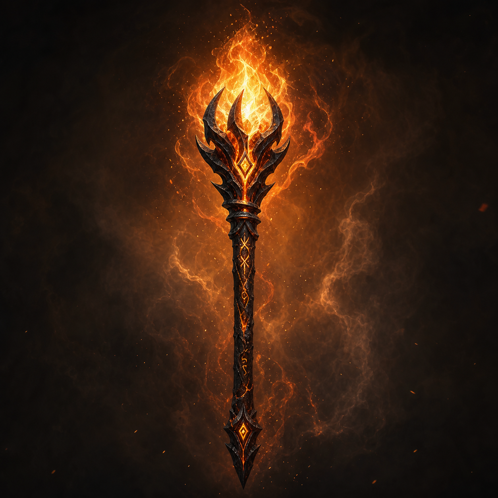

# Firestaff

<p align="center">
  
</p>

<p align="center">
  <a href="https://github.com/yeager/firestaff/actions/workflows/verify.yml"></a>
  <a href="LICENSE"></a>
  
</p>

An open-source engine port of **Dungeon Master** (1987) and **Chaos Strikes Back** (1989) for modern platforms.

## Status

Firestaff now has a real front door and a real in-game slice.

**Working today:**
- launcher with game selection
- persistent startup settings
- DM1 asset validation via MD5
- runtime language / graphics / window-mode switching in the launcher
- first in-game DM1 view with real dungeon loading
- real movement / facing / tick updates backed by world state
- deterministic verification suite still green

**Not there yet:**
- full classic Dungeon Master viewport rendering
- full audio layer
- complete CSB / DM2 asset support
- full end-to-end playable UI/HUD flow

## What Firestaff is

Firestaff is a deterministic, modular re-implementation of the FTL Games engine, designed to run on **macOS, Linux, and Windows**.

The project is built around portable C, explicit data structures, and aggressive verification. The goal is not just to "run the game somehow", but to preserve its behaviour in a form that is inspectable, testable, and maintainable.

## Current feature snapshot

### Launcher
- DM1 / CSB / DM2 game list
- startup settings screen
- built-in fallback launcher card art
- future-ready slot system for real card assets
- clean path for future custom dungeon sources

### Engine-backed game view
- boots from real `DUNGEON.DAT`
- enters a real game-view state from the launcher
- displays dungeon-backed view state instead of fake placeholder text
- movement / turning / ticking mutate real world state
- pseudo-viewport slice now gives a forward-facing dungeon view

### Validation
- deterministic verification remains green
- DM1 asset detection is MD5-based, not filename-based
- CSB / DM2 validator path is scaffolded honestly, without invented support

## Running Firestaff

Launcher / game view:

```sh
./firestaff --data-dir "$HOME/.firestaff/data"
```

Headless launcher smoke test:

```sh
./run_firestaff_m11_launcher_smoke.sh
```

Verification suite:

```sh
./run_firestaff_m10_verify.sh "$HOME/.firestaff/data/GRAPHICS.DAT"
```

## Roadmap

### Next up
- make the pseudo-viewport feel more like a real dungeon face
- add first HUD / party presentation around the view
- bring in more real launcher art assets
- add verified CSB / DM2 asset hashes where evidence exists

### After that
- fuller viewport rendering
- audio layer
- broader settings coverage
- better language support
- stronger custom dungeon / custom map entry path
- first real CSB and **DM2** validator/data integration steps
- reorganise the codebase into clearer source directories instead of keeping everything in one flat pile

### Longer term
- full Chaos Strikes Back support
- preserve **Amiga CSB** in-game map support as a product requirement, not an optional extra
- full **Dungeon Master II** support
- replay system
- packaging and release builds

## Design principles

- **Use real game data whenever possible**
- **Do not fake support we have not verified**
- **Keep deterministic behaviour intact**
- **Build additive slices that stay green**
- **Prefer honest progress over flashy shortcuts**

## Credits

Firestaff's development has been informed by **Christophe Fontanel's** reverse-engineering work on [ReDMCSB](http://dmweb.free.fr/?q=community/redmcsb). His documentation of the original engine's bugs, quirks, and mechanics has been invaluable as a reference, though no ReDMCSB source code is included in Firestaff.

The original Dungeon Master and Chaos Strikes Back games were designed by **Doug Bell**, **Dennis Walker**, **Mike Newton**, **Andy Jaros**, and **Wayne Holder** at FTL Games.

## Licence

Firestaff is released under the **MIT Licence**. See [LICENSE](LICENSE).

This licence covers **only the engine code**. Dungeon Master and Chaos Strikes Back are © FTL Games / Software Heaven, Inc. You must own a legal copy of the original games to use them with Firestaff. No original assets are distributed with this project.

## Contributing

Issues and discussion are welcome. See [CONTRIBUTING.md](CONTRIBUTING.md) for repository policy and current contribution guidance.

## Links

- Dungeon Master Encyclopaedia: [dmweb.free.fr](http://dmweb.free.fr/)
- ReDMCSB reference project: [dmweb.free.fr/?q=community/redmcsb](http://dmweb.free.fr/?q=community/redmcsb)
- Project tagline: *An open Dungeon Master engine, deterministic, modular, museum-grade*
