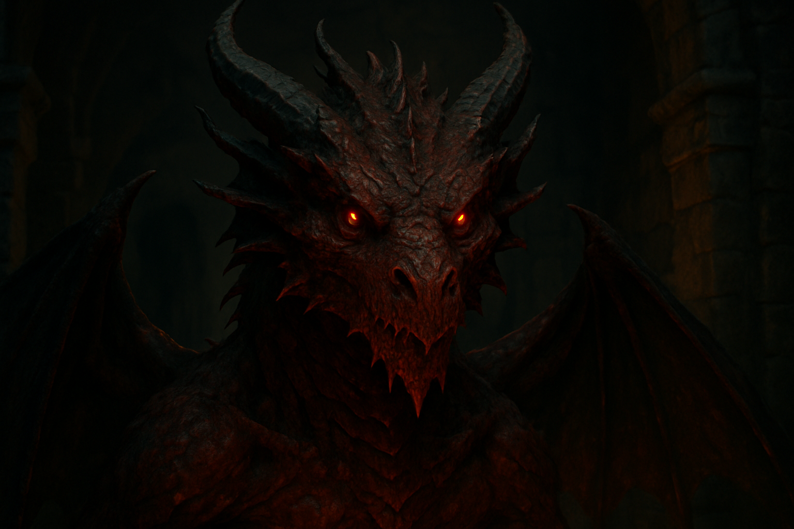
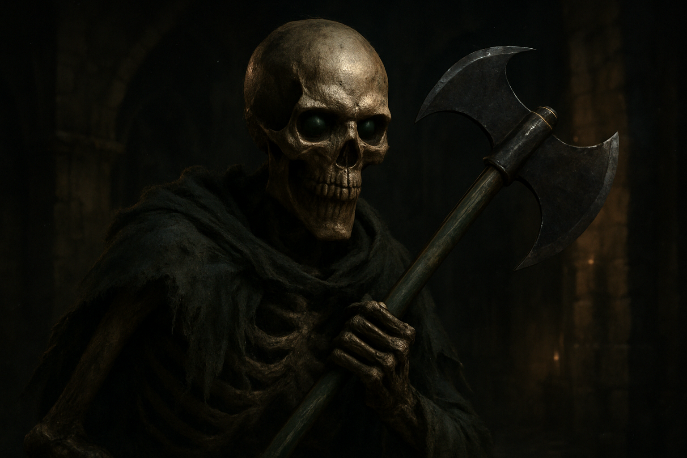
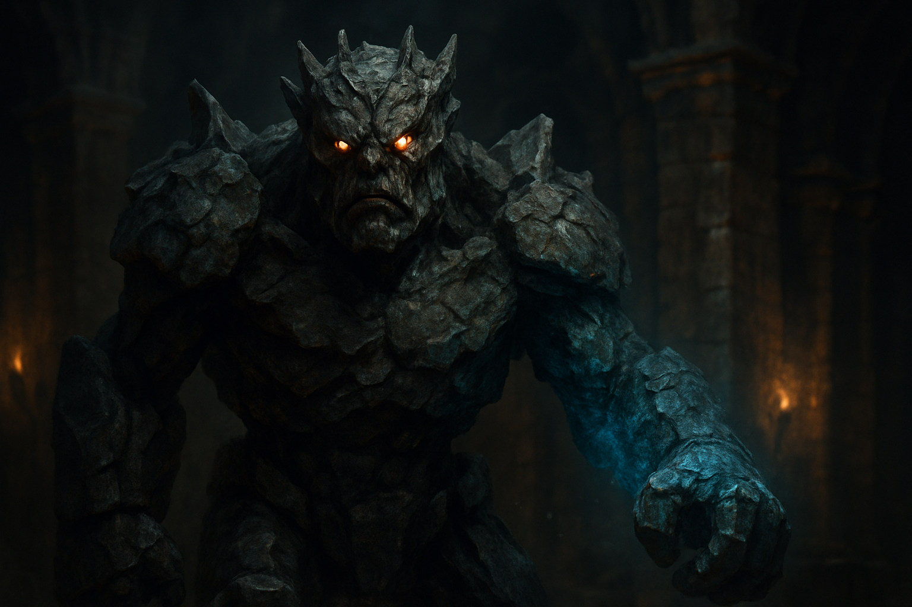
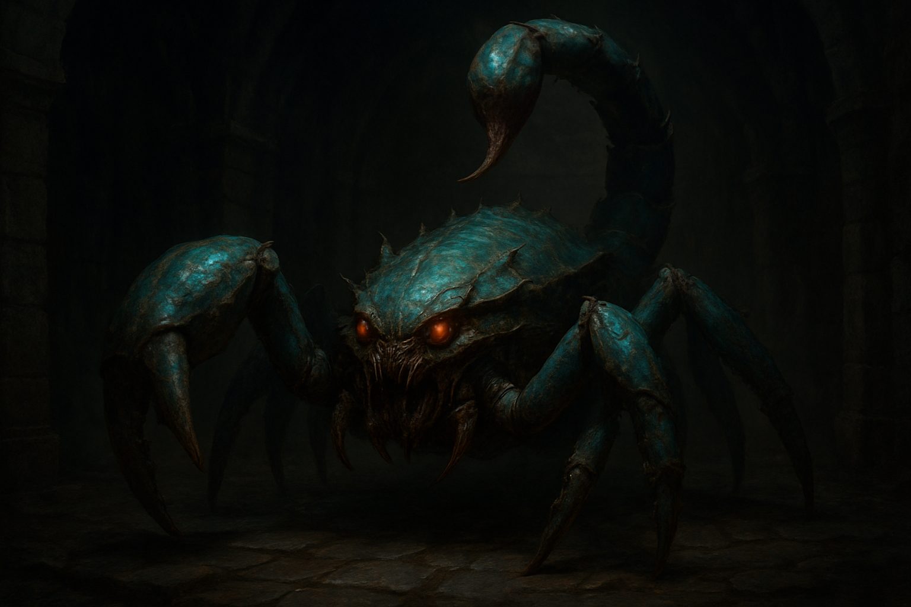
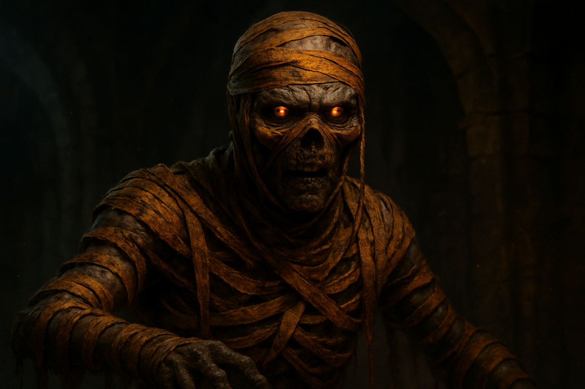

# Firestaff

<p align="center">
  
</p>

<p align="center">
  <a href="https://github.com/yeager/firestaff/actions/workflows/verify.yml"></a>
  <a href="LICENSE"></a>
  
  <a href="https://github.com/sponsors/yeager"></a>
</p>

<p align="center">
  Firestaff is a long-haul reverse-engineering and parity project. If you want to help fund the verification runs, reference capture work, packaging, and token burn behind it, you can support it at <a href="https://github.com/sponsors/yeager">GitHub Sponsors</a>.
</p>

An open-source engine project for **Dungeon Master** (1987), **Chaos Strikes Back** (1989), and later **Dungeon Master II**, with a clear three-track product plan:

- **V1, Original**: original-faithful presentation and behaviour, with a shared startup menu above the games
- **V2, Enhanced 2D**: higher-resolution 2D presentation, wider aspect ratios, richer assets, same game feel
- **V3, Modern / 3D**: a later full reinterpretation

## Status

**Firestaff 0.2.0 is an early macOS preview release.**

It already has a real launcher, a real in-game DM1 slice, a modern high-resolution startup menu, bounded original-version detection, and a growing verified engine core. Recent work has also tightened V1 parity honestly: movement / door / sensor ownership is being pushed into source-backed compat/runtime paths, original-reference tooling is now in-tree, and `SONG.DAT` decoding groundwork has landed.

**Working today:**
- launcher with DM1 / CSB / DM2 entries
- modern high-resolution true-color startup menu (1280x720 HD, 24-bit RGB) as the shared front door
- persistent startup settings
- selected-version status and per-game checksum indicators in the startup menu
- MD5-based original-data detection for bounded DM1 / CSB / DM2 version sets
- self-contained macOS app packaging with bundled SDL3 for preview releases
- explicit launcher / game / settings flow
- real dungeon loading from `DUNGEON.DAT`
- real movement / facing / ticking backed by world state
- melee attack, item, spell, stair, pit, teleporter, XP, save/load, and survival slices wired through the game core
- source-backed ownership migration landed for post-move environment, movement legality, door actuation, sensor runtime wiring, animating door states, and creature walkability
- increasingly asset-backed viewport rendering using real `GRAPHICS.DAT` data
- original-reference capture / overlay tooling now exists for stricter V1 parity measurement
- `SONG.DAT` format + loader/decoder groundwork is landed and probe-verified
- deterministic verification suite still green

**Not there yet:**
- full V1 original-presentation parity
- complete CSB / DM2 runtime support
- runtime audio still uses placeholder playback paths even though `SONG.DAT` decoding groundwork exists
- full endgame / dialog / launcher-product polish
- final cross-platform packaging

## Creature Art

Firestaff currently ships five finished launcher creature cards, with five more creatures tracked as the next art set.

<p align="center">
  
  
  
  
  
</p>

Finished card art currently shown in the launcher sidebar:
- Red Dragon
- Skeleton
- Stone Golem
- Giant Scorpion
- Mummy

Next creature set tracked for card-art follow-up:
- Swamp Slime
- Giggler
- Screamer
- Demon
- Vexirk

The finished creature cards in `assets/cards/creatures/` are used in the startup menu sidebar today, selected fresh each launch. The remaining five creatures are present in the repository as reference inputs and should be promoted to finished launcher cards before they are shown in the README gallery.

## What Firestaff is

Firestaff is a deterministic, modular re-implementation of the FTL Games engine, designed to run on **macOS, Linux, and Windows**.

The project is built around portable C, explicit data structures, and aggressive verification. The goal is not just to "run the game somehow", but to preserve its behaviour in a form that is inspectable, testable, and maintainable.

## Current feature snapshot

### Launcher
- DM1 / CSB / DM2 game list
- startup settings screen
- built-in and external-ready card-art path
- persistent configuration
- clean base for explicit **V1 / V2 / V3** mode selection

### Engine-backed game view
- boots from real `DUNGEON.DAT`
- enters a real game-view state from the launcher
- movement / turning / ticking mutate real world state
- melee attack, inspect, and champion cycling work in the live view
- item pickup/drop, spells, stairs, pits, teleporters, XP, quicksave/load, and survival systems are wired through the core
- viewport rendering now includes real walls, floor sets, ornaments, item sprites, creature sprites, dynamic lighting, torch decay, and combat feedback slices

### Validation
- deterministic verification remains green
- DM1 asset detection is MD5-based, not filename-based
- M10 remains protected while M11/M12 advance in verified slices
- CSB / DM2 support is planned honestly, without pretending the runtime is already complete

## Running Firestaff

### Quick start for macOS preview

1. Put your legal original game files under `~/.firestaff/originals/`
2. Launch Firestaff
3. Pick a game and version in the startup menu
4. Look for a green checkmark before launch

Launcher / game view:

```sh
./firestaff --data-dir "$HOME/.firestaff/data"
```

Original-data search order:
1. an explicit path, if provided
2. `~/.firestaff/originals/` on macOS/Linux, or `<installation-directory>\originals` on Windows
3. legacy Firestaff data-dir fallback such as `~/.firestaff/data/`

Version status in the startup menu:
- green checkmark = matching original file(s) found for the selected version
- red cross = selected version is missing or does not match the expected checksum
- unmatched versions stay visible, but launch is blocked honestly until matching originals are found

In the game view: `Enter` inspects, `Space` acts or waits, `Tab` cycles the active champion, `Esc` returns to the launcher. You can also click the viewport to inspect, click the control strip to move/act, and click a party card to arm a champion directly.

Headless launcher smoke test:

```sh
./run_firestaff_m11_launcher_smoke.sh
```

Verification suite:

```sh
./run_firestaff_m10_verify.sh "$HOME/.firestaff/data/GRAPHICS.DAT"
```

## Roadmap

### V1, Original
This is the priority track.

Goal: make Firestaff feel like the original games first, with only a shared startup menu above them.

Current focus:
- original-facing presentation parity
- original timing / animation / light behaviour
- finishing the current V1 parity chain pass by pass, with source-backed blocker tracking instead of vague "close enough" claims
- dialog and endgame runtime coverage
- verified CSB and then DM2 runtime integration
- bug/profile handling that preserves original behaviour where needed

### V2, Enhanced 2D
Built on top of a finished V1 baseline.

Planned direction:
- higher resolution
- wider aspect ratios including 16:9 and 4K presentation
- richer 2D assets and UI polish
- improved readability without losing the underlying game feel

Current bounded V2 UI slice status:
- real Wave 1 assets exist for the viewport frame, action area, spell area, status-box family, party HUD cell family, and a first shared four-slot party HUD strip expansion
- the current engine-side V2 slice remains opt-in behind `FIRESTAFF_V2_VERTICAL_SLICE=1`
- a first bounded initial in-game 4K capture/composition path now exists; see `assets-v2/ui/wave1/vertical-slice/FIRST_4K_RENDER.md`
- portraits and a full final HUD typography system are still pending future V2 passes

### V3, Modern / 3D
A later reinterpretation track.

Planned direction:
- modern presentation
- 3D rendering
- freer redesign, built only after V1 has a trustworthy parity baseline

## Design principles

- **V1 parity comes before V2/V3 polish**
- **Use real game data whenever possible**
- **Do not fake support we have not verified**
- **Keep deterministic behaviour intact**
- **Build additive slices that stay green**
- **Prefer honest progress over flashy shortcuts**

## Credits

Firestaff's development has been informed by **Christophe Fontanel's** reverse-engineering work on [ReDMCSB](http://dmweb.free.fr/community/redmcsb/). His documentation of the original engine's bugs, quirks, and mechanics has been invaluable as a reference, though no ReDMCSB source code is included in Firestaff.

The original Dungeon Master and Chaos Strikes Back games were designed by **Doug Bell**, **Dennis Walker**, **Mike Newton**, **Andy Jaros**, and **Wayne Holder** at FTL Games.

## Licence

Firestaff is released under the **MIT Licence**. See [LICENSE](LICENSE).

This licence covers **only the engine code**. Dungeon Master and Chaos Strikes Back are © FTL Games / Software Heaven, Inc. You must own a legal copy of the original games to use them with Firestaff. No original assets are distributed with this project.

## Sponsorship

If you want to help fund the absurd amount of reverse-engineering, verification, packaging, captures, and token burn behind Firestaff, you can sponsor the project on GitHub Sponsors.

- GitHub Sponsors: **https://github.com/sponsors/yeager**

It helps pay for the unglamorous but essential work: long parity passes, capture tooling, verification runs, and keeping the project moving without pretending the hard parts are already solved.

## Contributing

Issues and discussion are welcome. See [CONTRIBUTING.md](CONTRIBUTING.md) for repository policy and current contribution guidance.

## Links

- Dungeon Master Encyclopaedia: [dmweb.free.fr](http://dmweb.free.fr/)
- ReDMCSB reference project: [dmweb.free.fr/community/redmcsb/](http://dmweb.free.fr/community/redmcsb/)
- Project tagline: *An open Dungeon Master engine, deterministic, modular, museum-grade*
