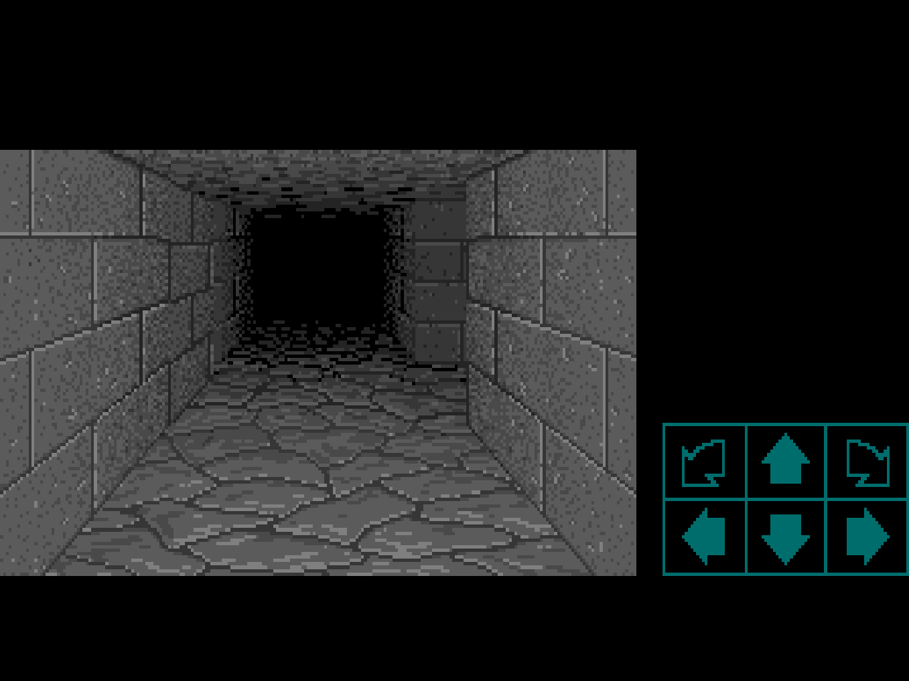
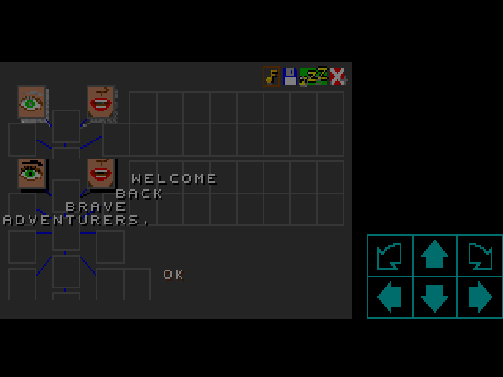

# Firestaff

**Five Dungeon Master games. One engine. Your original data.**

Firestaff is a source-faithful reimplementation of Dungeon Master engines,
built from scratch in portable C. **The only currently available playable
game is Dungeon Master v1 (PC DOS 3.4).** CSB, DM2, Theron's Quest and DM
Nexus are development targets and are not presented as finished games.

[](https://github.com/yeager/firestaff/releases/latest)
[](https://github.com/yeager/firestaff/actions/workflows/verify.yml)
[](LICENSE)
[]()

<p align="center">
  
</p>

## Supported Games

| Game | Platform | Reference Source | Status |
|------|----------|-----------------|--------|
| **Dungeon Master v1** | PC DOS 3.4 data | ReDMCSB / DMWeb | **Available and playable** |
| **Chaos Strikes Back** | PC DOS 3.4 data | ReDMCSB / CSBWin | Development only |
| **Dungeon Master II: Skullkeep** | DOS data | skproject | Development only |
| **DM Nexus** | Sega Saturn data | Saturn disassembly | Development only |
| **Theron's Quest** | PC Engine CD data | PC Engine disassembly | Development only |

## Screenshots

Only real runtime captures appear here. The captures below are from the
currently available DM1 v1 PC34 runtime and original game data.

### Dungeon Master

| DM1 v1 dungeon | DM1 v1 HUD / HoC route |
|----------------|------------------------|
|  |  |

Screenshots for CSB, DM2, Theron's Quest, DM Nexus and future custom art are
**Coming soon** because those game versions are not currently available.

## Why Firestaff?

**Source-faithful, not guesswork.** Every gameplay-critical path is anchored to
the best available reference source code. DM1 and CSB are locked against
ReDMCSB. DM2 is locked against skproject. Nexus and Theron's Quest are verified
through Saturn SH-2 disassembly and PC Engine CD analysis respectively. The
codebase cites original source files and function names in comments so you can
trace any behavior back to its reference.

**Your data, verified.** Firestaff scans your game files by cryptographic hash,
not by filename. Put files anywhere — loose, in ZIPs, in ISO/BIN disc images —
and the scanner finds them. The checked-in hash catalog covers original assets
across all five games and their documented variants. Games with missing
required data cannot launch; there is no guessing or silent fallback.

**Two presentation paths.** Games with a verified runtime route offer
pixel-perfect **Original** rendering at the native resolution and selectable
**Custom** presentation modes with filtered, upscaled and modern targets up to
3840×2160. Custom always runs on top of the same source-locked engine — it
never bypasses collision, timing, combat or inventory logic. A game that has
not passed its launch gate is documented as bring-up work, not as a finished
playable target.

**Preservation-grade documentation.** Thousands of parity-evidence receipts,
focused tests and a [complete documentation index](docs/DOCUMENTATION_INDEX.md)
with a [comprehensive wiki](https://github.com/yeager/firestaff/wiki) covering
file formats, hardware architecture, reverse engineering details and
source-reference boundaries for all five games.

## Quick Start

1. **Download** from [GitHub Releases](https://github.com/yeager/firestaff/releases/latest).
2. **Run once** so the data directory is created.
3. **Drop your game files** anywhere under the data directory.
4. **Launch.** The scanner finds your data and shows which games are ready.

| Platform | Status | Data directory |
|----------|--------|---------------|
| macOS | DM1 v1 development/release builds | `~/.firestaff/data/` |
| Linux | DM1 v1 build target | `~/.firestaff/data/` |
| Windows | DM1 v1 build target | `%USERPROFILE%\.firestaff\data\` |
| Steam Deck | Linux/AppImage packaging target; DM1 v1 only | `~/.firestaff/data/` |
| iOS / Android | Not currently available | Coming soon |

Suggested layout:

```
~/.firestaff/data/
  dm1/
  csb/
  dm2/
  nexus/
  theron/
```

## In-game runtime panel

Press **F10** in any game to open the compact runtime graphics and cheats
panel. Change presentation, filters, effects, FPS overlay, window settings and
the implemented shared cheat controls while the game is running; changes are
applied and saved immediately. Use **Up/Down** plus **Left/Right** or the
mouse, **Tab** for pages and **Esc** to close. See the [runtime panel guide](docs/runtime_graphics_and_cheats.md)
for the complete control list and source-data boundaries.

## Download

The current playable scope is **DM1 v1**. Package availability follows the
release workflow for the target platform; a package does not imply that CSB,
DM2, Theron's Quest or DM Nexus is playable. iOS and Android packages are not
currently available.

## Game Status

### Dungeon Master (PC 3.4)

Available and source-locked against ReDMCSB for the PC DOS 3.4 data path.
The current runtime includes the title/entrance route, dungeon viewport,
movement, HUD, Hall of Champions and original-data asset loading. Save corpus
coverage and broader external capture verification remain active work; this
README does not claim complete parity.

### Chaos Strikes Back (PC 3.4)

The source and runtime work is active, but CSB is not currently available as a
finished playable release. No completed-playability claim is made here.

### Dungeon Master II: Skullkeep

DM2 bring-up work references skproject. It is not currently available as a
finished playable release.

### DM Nexus (Sega Saturn)

DM Nexus analysis and runtime bring-up are active. It is not currently
available as a finished playable release.

### Theron's Quest (PC Engine)

Theron's Quest analysis and Track 02 bring-up are active. It is not currently
available as a finished playable release. See
[`docs/THERON_CAPTURE_READINESS.md`](docs/THERON_CAPTURE_READINESS.md).

The cross-game status and evidence boundary are kept in
[`docs/PROJECT_STATUS.md`](docs/PROJECT_STATUS.md). Presentation work follows
the same order for every game: startup, menu, HUD, then viewport.
The complete documentation map is in
[`docs/DOCUMENTATION_INDEX.md`](docs/DOCUMENTATION_INDEX.md).

## Graphics Modes

| Mode | Resolution | Description |
|------|-----------|-------------|
| **Original** | 320×200 | Pixel-faithful rendering at the original cadence and palette |
| **Custom** filtered | 640×400 – 3840×2160 | CRT-style scanlines, palette correction and sharpening |
| **Custom** upscaled | 640×400 – 3840×2160 | Clean modern output preserving the original look |
| **Custom** modern | 640×400 – 3840×2160 | New art and UI experiments |

## Command-Line Options

```
firestaff [options]
  --game <id>           Pre-select dm1, csb, dm2, nexus or theron
  --scale-mode <n>      1=Original, 2=Custom enhanced, 3=Custom modern
  --data-dir <path>     Game-data root directory
  --scan-data           Scan and report found/missing game files
  --fullscreen          Run fullscreen
  --no-vsync            Disable vertical sync
  --fps                 Show FPS counter
  --duration <ms>       Run for a fixed duration (-1 = run until exit)
  --width <px>          Window width
  --height <px>         Window height
  --script <cmds>       Comma-separated input script
  --version             Print version and exit
  --help, -h            Print help
```

Examples:

```bash
firestaff --scan-data
firestaff --game dm1 --scale-mode 1
firestaff --data-dir ~/Games/DM --fullscreen
```

## Building from Source

Requirements: CMake 3.20+, a C11 compiler, SDL3, Ninja.

```bash
brew install sdl3          # macOS
git clone https://github.com/yeager/firestaff.git
cd firestaff
cmake -S . -B build -DCMAKE_C_COMPILER=cc -G Ninja
ninja -C build
./build/firestaff --help
```

Run the test suite:

```bash
ctest --test-dir build -j4 --output-on-failure
```

Some tests require original game data to pass.

### Continuous integration

Every push to `main` runs strict warnings, asset hygiene, native CMake builds
on Ubuntu, macOS and Windows, headless probes and cross-platform determinism.
The workflow cancels an older `main` run when a newer commit is pushed. A
cancelled run is not a failed test; inspect the newest run before debugging
CI. See [`docs/CI.md`](docs/CI.md) for the checks and common failure
signatures.

## Architecture

```
Launcher UI (M12)
  └─ Game engine, render loop, input and audio (M11)
       └─ Data layer, dungeon state, combat and timeline (M10)
            └─ Original game files supplied by the player
```

| Directory | Purpose |
|-----------|---------|
| `src/engine/` | SDL3 loop, game view, rendering, input, save/load, audio |
| `src/ui/` | Launcher, menu state, rendering, hit-testing |
| `src/shared/` | Asset loading, hash validation, palette, config, localization |
| `src/frontend/` | Title screens, entrance sequences, boot presentation |
| `src/memory/` | Dungeon, movement, combat, sensors, timeline, savegame model |
| `src/dm1/` | DM1 source-locked runtime |
| `src/csb/` | Chaos Strikes Back runtime |
| `src/dm2/` | Dungeon Master II runtime |
| `src/nexus/` | DM Nexus Saturn runtime |
| `src/tqr/` | Theron's Quest runtime |
| `src/dm1v2/` | DM1 Custom presentation |
| `tests/` | Thousands of integration tests and source-lock gates |
| `parity-evidence/` | Thousands of verification documents |

## The Engine in Numbers

| Metric | Count |
|--------|-------|
| Lines of C | 1,000,000+ |
| Source files | 2,600+ |
| Headers | 2,500+ |
| Test files | 3,200+ |
| Automated checks | Thousands |
| Parity-evidence documents | Thousands |
| Verified game-data hashes | Cross-game catalog |
| Currently verified game-language scope | DM1 v1 English |

## Source References

- [ReDMCSB](http://dmweb.free.fr/Stuff/ReDMCSB_WIP20210206.7z) — reconstructed C source for DM1 and CSB (PC 3.4)
- [CSBWin](https://github.com/BeipDev/CSBWin) — Chaos Strikes Back reimplementation
- [skproject](https://github.com/gbsphenx/skproject) — reconstructed C source for DM2
- [Greatstone](http://greatstone.free.fr/dm/) — dungeon maps, data notes, graphics atlas
- [DMWeb](http://dmweb.free.fr/) — community documentation, file format specs, tools

## Localization

The launcher contains gettext catalogs and language-selection plumbing for
multiple languages, including Swedish, but the currently available DM1 v1
playable scope is verified in English. Do not interpret the presence of PO
files as proof that every game and every string is fully localized. Swedish
and the other language targets remain incomplete until their runtime coverage
is verified.

## Wiki

The [Firestaff Wiki](https://github.com/yeager/firestaff/wiki) has detailed
documentation for users, developers and preservationists:

The repository's [project status](docs/PROJECT_STATUS.md) is the canonical
short summary; the wiki expands each game's formats, hardware and reverse-
engineering evidence without changing the playability claims.

- Per-platform install guides (macOS, Windows, Linux, iOS AltStore, Android sideload)
- Reverse engineering documentation for all five games (function registries, file formats, data structures)
- File format specifications: DUNGEON.DAT, GRAPHICS.DAT (IMG3/IMG1/GDAT), save formats
- Technical references and source-lock architecture
- Deep internals: DM1 PC34, CSB DSA, DM2 GDAT, Nexus DGN/PRS3/Saturn hardware, Theron's Quest Track 02
- Preservation worklists for ReDMCSB, CSBWin and skproject

## Legal

Firestaff is a clean-room engine reimplementation. You need original game files
that you legally own. No copyrighted game data is included.

Dungeon Master, Chaos Strikes Back and Dungeon Master II are trademarks of FTL
Games. DM Nexus is a trademark of Victor Interactive Software. Theron's Quest is
a trademark of Working Designs / Victor Interactive Software.

## License

MIT. See [LICENSE](LICENSE).
