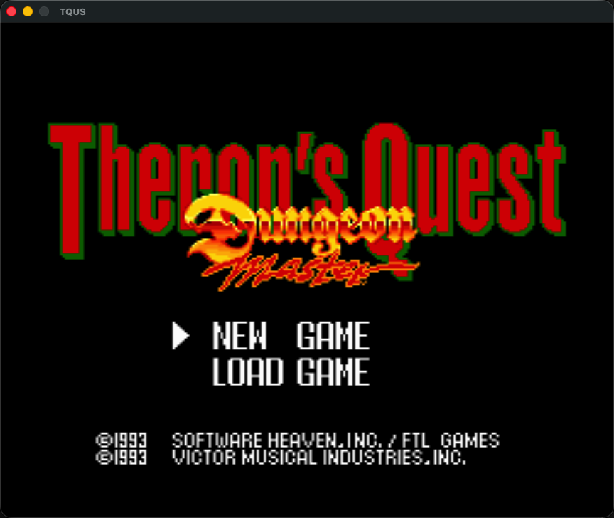
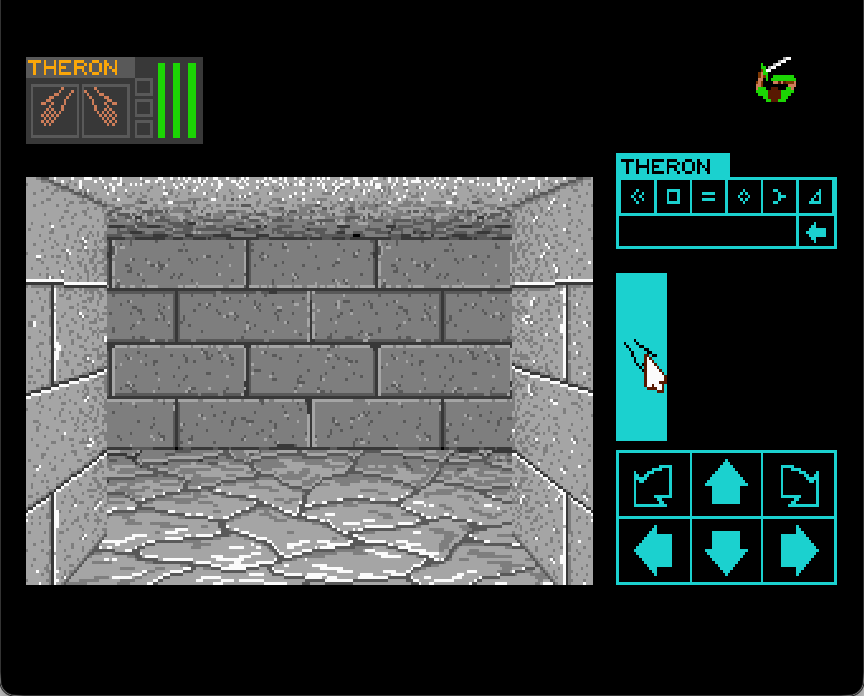

# Firestaff

Firestaff is a clean-room engine for the Dungeon Master games. It reads the
original files you own, identifies each edition by its content hash and keeps
that data separate from the program.

Dungeon Master for PC DOS 3.4 is the current playable route. Its native Atari
ST graphics container is also recognised and launch-ready when matching media
is supplied. Chaos Strikes Back starts from verified native Amiga editions by
default; Atari ST and FM Towns have their own native data paths. CSB campaign,
save and presentation parity are still under active development. Dungeon Master
II, DM Nexus and Theron's Quest are also active development routes, not
finished releases.

[](https://github.com/yeager/firestaff/actions/workflows/verify.yml)
[](LICENSE)

<p align="center">
  
</p>

## Current state

Dungeon Master for PC DOS 3.4 is the most complete route: startup, menus,
dungeon view, HUD, controls, combat and save handling use original data.

The other games are active development routes. Firestaff detects their real
media and exposes only paths with a verified handoff; it never borrows data
from another edition to fill a gap. The detailed status is kept in
[project status](docs/PROJECT_STATUS.md). The published documentation is
available at [yeager.github.io/firestaff](https://yeager.github.io/firestaff/).
The dated [preservation status](docs/PRESERVATION_STATUS_2026-08-11.md)
separates source/disassembly evidence, real-media receipts and open routes.

| Game | Current scope |
|---|---|
| Dungeon Master | Playable PC DOS 3.4 route. Atari ST media has its own native graphics decoder and launch path; further parity work continues. |
| Chaos Strikes Back | Native Amiga is the default route when verified media is available. Atari ST and FM Towns have their own native data and startup paths; a stock legacy CSBWin save is verified through both menu and CLI when paired with matching Atari ST data. The Atari C017 inventory uses its original C232/C042–C048 icon atlas, including empty-slot symbols; the transient attacking-hand overlay and campaign parity remain open. |
| Dungeon Master II: Skullkeep | Engine and data work in progress. |
| DM Nexus | Saturn real-data bring-up in progress. |
| Theron's Quest | PC Engine real-media bring-up in progress. |

Theron's Quest uses ordinary desktop controls in Firestaff: Up/W moves
forward, Down/S moves backward, and Left/A and Right/D turn while held.
Keypad 8/2/4/6 provides the same four directions. Left and right mouse
buttons are Button I and Button II; mouse motion only moves the normal pointer
and never changes the selected object or jumps between controls. On touch
screens, a short touch is Button I and a long touch is Button II.

### Authentic Theron's Quest reference capture





This is a real original-media Mednafen capture of the USA release, included
as reference evidence. The dungeon image is also original-media evidence; it
is not a generated image and neither image is presented as a completed
Firestaff runtime screenshot. See the [capture handoff record](docs/source-lock/theron-authentic-track02-handoff-2026-08-08.md)
for the media identities and scope.

## Chaos Strikes Back editions

Firestaff recognises original CSB editions by hash rather than by their folder
names. The scanner currently covers the following families when the required
matching data is present:

| Original family | What Firestaff does with it today |
|---|---|
| Amiga 3.1 and 3.5 | Default CSB route when a verified native program handoff is available. Native startup, entrance, supported HUD and viewport material use the Amiga data path. |
| Atari ST 2.0 and 2.1 | Native media uses its own animation, runtime, HUD and supported viewport-material routes. |
| FM Towns English and Japanese | Native CD installations use their version-specific Towns packages for the supported title, Game and Utility routes. |
| PC DOS 3.4 | Recognised source-reference edition. It remains useful for format and runtime comparison, but is not selected ahead of verified native Amiga CSB media. |
| PC-9801 Japanese 3.1 | Not supported. The media is retained only as preservation reference and cannot select an M11 data, startup, gameplay or input route. |
| X68000 Japanese 3.1 | Not supported. The media is retained only as preservation reference and does not select an M11 data, startup or gameplay route. |

Recognition is deliberately separate from a playability claim. A recognised
edition has passed the data gate; it does not imply that every screen, save
format or gameplay path has reached parity. Firestaff keeps each edition on
its own data path and never borrows files from another release to make a route
appear to work.

### CSBWin legacy saves

A complete original-named legacy CSBWin slot can resume with matching Atari
ST 2.0/2.1 `GRAPHICS.DAT` and `DUNGEON.DAT`, from both the launcher and CLI:

```bash
firestaff --game csb --data-dir /path/to/CSB --save /path/to/CSBGAME2.DAT
```

The loader validates the full save body and source provenance before starting.
It does not treat an arbitrary 512-byte header, renamed copy, compact roster,
or `DMSAVE.*` file as a CSB resume. Extended Features/DSA saves remain
fail-closed pending authenticated real-save coverage; the legacy path must not
be read as a claim of complete CSBWin compatibility.

## Your game data

No game data is included. Keep your legally owned files in any directory and
tell Firestaff where to look. It searches recursively and can inspect supported
loose files, ZIP archives and disc-image containers without relying on
filenames.

For the DAT-based games, `GRAPHICS.DAT` and `DUNGEON.DAT` must come from the
same original edition. The launcher rejects incomplete or mismatched pairs.
Optional title, animation, music and save files stay useful when they belong
to the same edition, but they do not replace the required game data.

Suggested layout:

```
~/.firestaff/data/
  dm1/
  csb/
  dm2/
  nexus/
  theron/
```

Use the launcher setting or `--data-dir` to select another root, then inspect
what was recognised:

```bash
firestaff --scan-data
firestaff --data-dir /path/to/games --scan-data
```

See [game-data setup](docs/DATA_SETUP.md) for the accepted media and the role
of optional files for each game. The [game-data format reference](docs/GAME_DATA_FORMATS.md)
explains the verified containers, record families and save boundaries.

Original BIOS/firmware and game media are never bundled with Firestaff or
stored in this repository. Supply your own legally obtained files through the
local data directory; repository CI enforces this boundary.

## Running Firestaff

Build from source when a suitable package is not available:

```bash
git clone https://github.com/yeager/firestaff.git
cd firestaff
cmake -S . -B build -DCMAKE_BUILD_TYPE=Debug
cmake --build build --parallel
./build/firestaff --scan-data
```

Firestaff requires CMake, a C11 compiler and SDL3. On macOS, SDL3 is available
through Homebrew:

```bash
brew install sdl3
```

Useful command-line options:

```text
firestaff --game <dm1|csb|dm2|nexus|theron>
          --data-dir <path>
          --platform <auto|pc|amiga|atari-st|fm-towns|pce|saturn>
          --csb-fmtowns-ja
          --csb-utility-disk
          --scan-data
          --fullscreen
          --scale-mode <n>
          --version
```

`--csb-fmtowns-ja` is an explicit CSB-only F31J request. It selects the
hash-verified Japanese FM Towns package and fails if that original package is
not present; it never guesses from the host language or falls back to F31E.
`--csb-utility-disk` opens the separately preserved FM Towns C06 Utility Disk
after the normal verified CSB F31 boot; it implies `--game csb --platform
fm-towns` and fails closed if that package is unavailable. The start menu also
has a dedicated **CSB Utility Disk (FM Towns)** entry. This is distinct from
the Atari R1 Hint Oracle (`--csb-hint-oracle`) and never substitutes its data
or UI. The Hint Oracle needs `--data-dir <root>` containing the verified Atari
R1 `HCSB.HTC`, `HCSB.DAT` and native `MINI.DAT`; those files may be loose or
inside a supported archive. `--save <MINI.DAT>` is optional and selects an
explicit native save instead of the verified R1 `MINI.DAT` found in that root.
The initial Japanese C06 Utility chooser additionally requires the user's
authorised 256 KiB `FMT_FNT.ROM`; set `FIRESTAFF_FMTOWNS_FONT_ROM` to that
file before launch. Firestaff uses the ROM only for its original Shift-JIS
glyphs and keeps the route closed if the file is missing or malformed; it
never substitutes a system font or installs the ROM into game data.

Run the local test suite with:

```bash
ctest --test-dir build --output-on-failure
```

Some tests need original game data and skip when that corpus is not present.

## How the project is built

The launcher selects a game and its verified data. The game layer then owns
rendering, input and runtime state, while the data layer reads the original
files and models the dungeon.

```text
Launcher
  └─ Game runtime
       └─ Dungeon and data layer
            └─ Original game files supplied by the player
```

Gameplay work is checked against primary references. DM1 and CSB use
[ReDMCSB](http://dmweb.free.fr/Stuff/ReDMCSB_WIP20210206.7z), with CSBWin and
documented original formats as additional references. DM2 uses skproject;
Nexus and Theron's Quest use their respective platform analysis and original
media.

The [documentation index](https://yeager.github.io/firestaff/DOCUMENTATION_INDEX.md)
links the user guides,
data notes and technical references. The [project status](docs/PROJECT_STATUS.md)
is the place to check the current boundary before relying on a development
route.

## Legal

Firestaff is a clean-room engine reimplementation. You need game files from
copies you legally own; the repository contains no copyrighted game data.

Dungeon Master, Chaos Strikes Back and Dungeon Master II are trademarks of FTL
Games. DM Nexus is a trademark of Victor Interactive Software. Theron's Quest
is a trademark of Working Designs and Victor Interactive Software.

## License

MIT. See [LICENSE](LICENSE).
