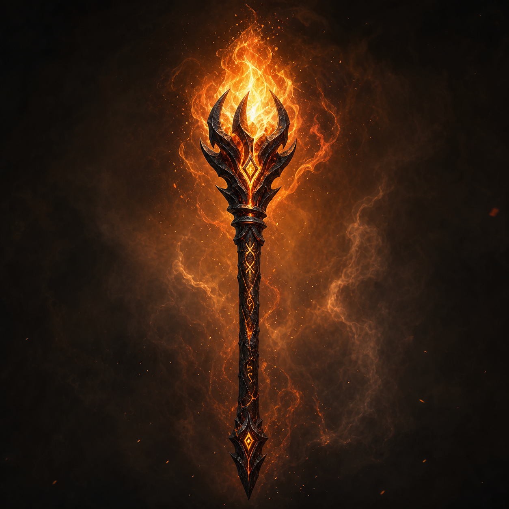
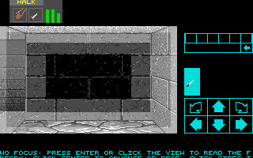
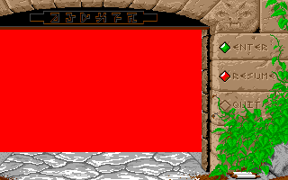
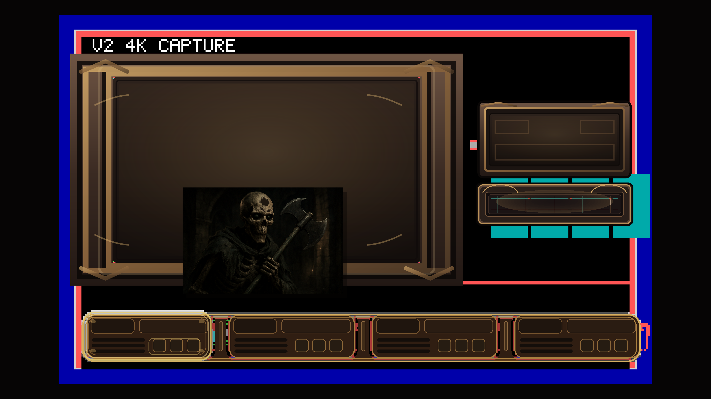

# Firestaff

**A source-faithful Dungeon Master engine for modern hardware.**

Firestaff brings the classic FTL dungeon crawlers to macOS, Windows,
Linux and Steam Deck era machines while keeping the original game logic
anchored to the best available source references. It runs original game
data you already own, validates it by hash, and lets you choose between
pixel-perfect **Original** presentation and the selectable **Custom**
presentation targets from 640x400 up to 3840x2160.

> ℹ️ The "Original" and "Custom" labels in this README correspond to the
> internal `V1` and `V2.0`/`V2.1`/`V2.2` code paths. Outside this file the
> internal `v1`/`v2` naming is still used in the codebase, AGENTS.md,
> CMake flags and the CLI `--scale-mode` argument.

[](https://github.com/yeager/firestaff/releases/latest)
[](https://github.com/yeager/firestaff/actions/workflows/verify.yml)
[](LICENSE)
[]()

<p align="center">
  
</p>

## Screenshots

Real in-game captures. The **Original** captures are taken from the
runtime at 320x200 with the original DM PC 3.4 VGA palette and the
original SWSH/TITLE/DUNGEON cadence. The **Custom** captures are taken
through the selectable filtered 640x400 target or the 4K 3840x2160
target, while gameplay still runs in the original 320x200 coordinate
space.

| Original (V1) dungeon view, 320x200 | Original (V1) TITLE.DAT render, 320x200 |
|---|---|
|  |  |

| Custom (V2.0/V2.1) filtered title, 640x400 | Custom (V2.1/V2.2) 4K presentation, 3840x2160 |
|---|---|
|  |  |

## Current Status

Firestaff is in active development. The launcher, data scanner, build
system, packaging scripts and source-lock verification framework are in
place. **DM1 Original** is the strongest runtime target today. The
other games have hash-verified launch profiles and substantial engine
slices, with end-to-end playability still being hardened game by game.

The table below separates runtime fidelity from presentation work. A
"verified slice" means the named behavior is covered by focused tests or
probes; it is not a claim that the whole game is finished.

For each game, **Original (V1)** is the pixel-faithful, source-locked
runtime. **Custom (V2.0..V2.2)** is the presentation family that runs
on top of the same engine: filtered 2x mode, AI-upscaled 10x mode, and a
modern art experiment. The three Custom modes share one selectable
resolution that the launcher offers from 640x400 through 4K
(3840x2160). Custom always keeps the Original command, collision,
timing and inventory routes.

| Game | Original (V1) | Custom (V2.0..V2.2) |
|---|---|---|
| **Dungeon Master (DM1)** | Playable and source-locked against the PC 3.4 lineage. v2.7.25 added 18 Group 8 bounded fixes including 2 real source-locked bug fixes (TAB-06 G0050 wound-defense, DUN-06 F0705 stairs NULL-deref) and 16 source-lock pins across F0284 cell rotation, F0150 step-delta, F0316/F0317 scent, F0192 poison resistance, BUG0_78 door-wound preserve, BUG0_16 projectile cap, F0822/F0824 explosion advance/despawn, F0830/F0831 lifecycle, F0501 party-location, F0758 potion power, and F0864 reincarnation RNG. 28 hand-drawn Latin Extended-A glyphs in M11 game-text fix 244/548 (44%) of `sv.po` msgstrs that previously rendered as SPACE. CSB launch verified end-to-end via `--scan-data` and `--game csb`. | All three Custom modes share one selectable resolution from 640x400 through 3840x2160; the filtered 2x mode is no longer locked to 640x400. Side-by-side Original/Custom seed and region manifests are in place. Full enhanced screenshot/pixel gates and broader presentation polish remain active. |
| **Chaos Strikes Back (CSB)** | Hash-verified launch/profile boundary, real DUNGEON.DAT load, dungeon handle handoff, object-chain access, imported champion stats/load behavior, party rotation, tick accumulation, timeline dispatch, wall text, and deterministic boot-to-viewport render slices are verified. End-to-end playability, title/import UI composition, broader command queue binding, and full viewport integration are still being hardened. | All three Custom modes share the same selectable 640x400..3840x2160 resolution. Original compatibility and launch/profile separation exist. HUD overlay and smooth-movement scaffolds are covered by probes, but enhanced assets, lighting, controller ergonomics, and full side-by-side screenshot verification remain open. |
| **Dungeon Master II: Skullkeep (DM2)** | Boot/profile, utility/import, world-state, save/load, weather, projectile-door, asset-loader, dungeon-loader, object-model, and map-state probes exist. Broader dungeon, rendering, mechanics, creature/combat, shops/NPCs, and real-runtime compatibility remain active work. | All three Custom modes share the same selectable 640x400..3840x2160 resolution. Enhanced asset, HUD, lighting/outdoor effects, smooth movement, touch/controller, and verification scaffolds are implemented. Custom remains presentation work on top of the still-active Original parity effort. |
| **DM Nexus (Saturn)** | Saturn DMDF/DGN parsing, world/runtime state, rendering slices, save/load, actor bounds, mechanics scaffolding, and verification paths exist. Launcher/game-loop handoff with real Saturn asset-path proof and broader runtime coverage remain active. | All three Custom modes share the same selectable 640x400..3840x2160 resolution once launchable. Asset, UI, lighting, and touch/controller slices exist, and v2.8.0 added the smooth-movement tick to the Custom render pipeline. Custom compatibility lock, launch/profile separation, and full verification remain behind the Original handoff proof. |
| **Theron's Quest** | JP/US Track 02 provenance is hash-verified. Parser, world/progression state, viewport/UI, mechanics, save/load, shop-table guards, direct hash-verified boot-profile loading, raw JP/US Track 02 bank-anchor offsets, US ISO bank-boundary signal, M11 command/tick handoff, and metadata-only runtime screenshot readiness receipts are verified. Tier 1 #5 strict boot-probe confirms JP canonical, JP extras, and US extras all reach `TQR level load` via `--data-dir`. Semantic Track 02 dungeon-table decoding, full dungeon loader parity, real `.srm` import, broader runtime playability proof, and README-eligible real screenshots remain active work. | Custom selection, settings, V2.0 filter config, V2.1 upscale, V2.2 shape/modern-asset scaffolding, and smooth movement gates are verified. Finished real PBR art, per-cell modern-art swap, enhanced UI overlays, and screenshot/material pixel gates remain active work. |

## What Firestaff Gives You

- **Source-faithful gameplay work**: DM1 and related systems are checked
  against ReDMCSB, CSBWin, skproject, CSB lineage sources and Greatstone data
  references.
- **Modern launcher**: a 1920x1080 start menu with per-game status, settings,
  language support, availability checks and hash-verified data discovery.
- **Game-data scanning**: Firestaff searches recursively by file hash, not by
  filename or folder layout. It lists required files that are found or missing.
- **Launch safety**: games with missing required data are shown as unavailable
  and cannot be started until the required hashes are present. Optional title,
  intro and other non-essential extras can be absent.
- **Hash-based direct launch**: `--data-dir <path>` boots the supplied
  variant via MD5-hash discovery in `m11_resolve_builtin_dungeon_path`
  + first-matched-version fallback in `M11_GameView_OpenSelectedMenuEntry`,
  so any non-default variant the scanner recognises (e.g. Theron US
  Track 02, CSB Amiga 3.3 Meynaf FR, DM1 legacy-dos PC34) launches
  without manual versionIndex tweaking. Tier 1 #5 strict boot-probe
  (`firestaff_tier1_strict_boot_probe` ctest entry) currently verifies
  all present in-scope paths reach their boot milestone.
- **Two presentation families per game**: pixel-faithful **Original** at
  320x200, and **Custom** with selectable filtered, upscaled, and modern
  targets up to 3840x2160.
- **Cross-platform C11 engine**: pure C, CMake, SDL3, no C++ dependency.
- **Packaging path**: preview packaging scripts exist for macOS DMG/ZIP,
  Windows ZIP/installer and Linux DEB/RPM.

## Latest Release

**Current version:** `3.0.11`.

The latest release packages the 2026-06-27/28 runtime-hardening work after
v3.0.10. It widens DM1 V1 source-locked gameplay gates, makes ZIP/gzip support
self-contained through bundled miniz by default, and adds bounded presentation
and data-handoff evidence across CSB, DM2, Nexus, and Theron's Quest. It does
not claim finished parity for those targets beyond the runtime slices now
covered by tests and probes.

### v3.0.11 release highlights

- **Bundled ZIP/gzip inflate**: default builds use bundled static miniz for
  ZIP cache materialization and Theron SRM gzip handling, avoiding an external
  zlib runtime dependency.
- **DM1 V1 gate expansion**: champion-panel refresh/pixel slices,
  waterskin/fountain flow, food/water state, timeline determinism, creature
  group splitting, and the D3C back-wall item pass are now source-locked.
- **Custom presentation gates**: DM1 V2.2 material checks, DM2 V2.2 modern-art
  swap coverage, and DM2 HUD widget runtime/synthetic-manifest gates tighten
  the enhanced presentation path without shipping replacement game art.
- **Cross-game handoff coverage**: CSB graphics/save boundaries, Nexus
  BPX/BPK/save/light paths, and Theron SRM/Track 02/V2 HUD paths have new
  focused verification.

## Download

Get the latest build from [GitHub Releases](https://github.com/yeager/firestaff/releases/latest).

| Platform | Package |
|---|---|
| macOS | DMG and ZIP |
| Windows | Installer and ZIP |
| Linux x86_64 | DEB and RPM |
| Linux ARM64 / Steam Deck | DEB and RPM |

All game data is user-supplied. Firestaff does not include copyrighted game
assets.

## Quick Start

1. Download Firestaff from [Releases](https://github.com/yeager/firestaff/releases/latest).
2. Run it once so the default data directory is created.
3. Put your original game files anywhere under the configured data directory.
4. Start Firestaff. The launcher scans the directory automatically and shows
   which games are ready.

Default data directory on macOS and Linux:

```text
~/.firestaff/data/
```

Default data directory on Windows:

```text
<Firestaff installation folder>\data\
```

Suggested subdirectories:

```text
~/.firestaff/data/
  dm1/
  csb/
  dm2/
  nexus/
  theron/
```

Filenames are less important than file hashes. Firestaff searches
recursively, so a custom folder layout works as long as the original files are
present. Game data may also live inside ZIP archives or ISO/BIN disc images;
the scanner hashes archive contents and reports matches as virtual paths.

## Game Data Scanner

Use the CLI scanner to see what Firestaff can find:

```bash
firestaff --scan-data
```

or:

```bash
firestaff --scan-game-data
```

The scanner reports required data per game. Required files block launch when
missing. Non-essential extras such as title or intro animation files are
reported as optional and can be skipped.

ZIP files are supported for hash discovery across the game-data root. Stored
entries are supported everywhere; deflated entries are supported when Firestaff
is built with zlib, which is enabled automatically when CMake finds it. ISO/BIN
disc images are scanned as ISO 9660 containers, covering DM2 disc images and
the existing Saturn/Nexus data-image path. For DM1, CSB, and DM2, required
files found inside archives are materialized into Firestaff's local asset cache
before launch so the runtime still receives ordinary game-data paths.

You can point Firestaff at a custom root:

```bash
firestaff --data-dir ~/Games/FirestaffData --scan-data
```

The launcher also exposes the configured data directory and game availability
in the start menu.

## Command-Line Options

```text
firestaff [options]
  --duration <ms>       Run for a fixed duration (-1 = run until exit)
  --width <px>          Window width
  --height <px>         Window height
  --scale-mode <n>      1=Original, 2=Custom enhanced, 3=Custom modern
  --script <cmds>       Comma-separated input script
  --data-dir <path>     Game-data root
  --scan-data           Scan game data and print found/missing files
  --scan-game-data      Alias for --scan-data
  --game <id>           Pre-select dm1, csb, dm2, nexus or theron
  --fullscreen          Run fullscreen
  --no-vsync            Disable vertical sync
  --fps                 Show FPS counter
  --version             Show version and exit
  --help, -h            Show help
```

> ℹ️ The `--scale-mode` numbers `1`/`2`/`3` are stable across releases and
> match the internal `V1`/`V2.1`/`V2.2` code paths. `1` is the pixel-faithful
> **Original** mode; `2` and `3` are the two **Custom** presentation modes.

Examples:

```bash
firestaff --scan-data
firestaff --game dm1 --scale-mode 1
firestaff --data-dir ~/Games/FirestaffData --fullscreen
firestaff --duration 5000 --fps
```

## Graphics Modes

| Mode | Resolution target | Purpose |
|---|---|---|
| **Original** (V1) | 320x200 | Pixel-faithful original rendering at the DM PC 3.4 cadence |
| **Custom** filtered (V2.0) | 640x400..3840x2160 (user-selectable) | 2x presentation of the original framebuffer with CRT scanlines, palette correction and sharpening |
| **Custom** upscaled (V2.1) | 640x400..3840x2160 (user-selectable) | Cleaner modern output while preserving the DM look |
| **Custom** modern (V2.2) | 640x400..3840x2160 (user-selectable) | New modern art and UI experiments |

**Original** owns gameplay-critical behavior. **Custom** modes are
presentation layers and must not bypass source-locked command, collision,
timing or inventory routes.

## Architecture

```text
M12  Modern launcher UI
  -> M11 game engine, render loop, input and audio
      -> M10 data layer, dungeon state, graphics, combat and timeline
          -> Original game files supplied by the player
```

Main source areas:

| Directory | Purpose |
|---|---|
| `src/engine/` | SDL loop, game view, rendering, input, save/load and audio |
| `src/ui/` | Modern launcher, menu state, rendering and hit-testing |
| `src/shared/` | Asset loading, hash validation, palette, config and localization |
| `src/frontend/` | Title screens, entrance sequences and boot presentation |
| `src/memory/` | Dungeon, movement, combat, sensors, timeline and savegame model |
| `src/dm1/` | DM1 source-locked runtime systems |
| `src/dm1v2/` | DM1 enhanced presentation systems |
| `src/csb/` | Chaos Strikes Back runtime and presentation work |
| `src/dm2/` | Dungeon Master II runtime and presentation work |
| `src/nexus/` | Saturn DM Nexus DMDF/DGN support |
| `src/theron/` | Theron's Quest support |
| `tests/` and `probes/` | Integration tests, source-lock gates and headless probes |

## Source Fidelity

Firestaff is built around source references, not guesswork.

Primary references:

- [ReDMCSB](http://dmweb.free.fr/Stuff/ReDMCSB_WIP20210206.7z) for DM1 and
  large parts of the PC-34 lineage.
- [CSBWin](https://github.com/BeipDev/CSBWin) and
  [CSB](https://github.com/zelurker/CSB) for Chaos Strikes Back lineage.
- [skproject](https://github.com/gbsphenx/skproject) for Dungeon Master II.
- [Greatstone](http://greatstone.free.fr/dm/) for dungeon maps, data notes and
  graphics atlas material.

Source-lock comments in the code cite the relevant original source files and
functions for gameplay-critical behavior.

## Building from Source

Requirements:

- CMake 3.20 or newer
- A C11 compiler
- SDL3

On macOS:

```bash
brew install sdl3
```

Build:

```bash
git clone https://github.com/yeager/firestaff.git
cd firestaff
cmake -B build -DCMAKE_BUILD_TYPE=Release
cmake --build build --parallel
./build/firestaff --help
```

Run the headless Phase A probe:

```bash
SDL_VIDEODRIVER=dummy ./build/firestaff_m11_phase_a_probe
```

Run the full local test set:

```bash
ctest --test-dir build --output-on-failure
```

Some integration tests need original game data.

## Localization

The launcher uses gettext PO files and supports a broad language set, including
English, Swedish, German, French, Spanish, Italian, Portuguese, Dutch, Polish,
Czech, Russian, Japanese, Korean, Chinese, Danish, Norwegian, Finnish,
Hungarian and Turkish.

The M11 game-text pipeline covers non-ASCII characters that the original
engine did not have glyphs for:

- **28 hand-drawn Latin Extended-A glyphs** (Ä Ö Å Ü ß é è ê ç à â î ï ô û
  ñ ã õ ü ï ø) plus a UTF-8 decoder. Restores 244 of 548 (44%) of
  `sv.po` msgstrs that previously rendered as SPACE.
- **TTF font cache** (`firestaff_font_cache_pc34_compat.c`): per-language
  TTF lookup chain covering all 19 l10n languages with
  `<asset>/fonts/NotoSans-<lang>.ttf`, system fallback (`Arial
  Unicode.ttf` on macOS, DejaVu on Linux, Arial on Windows), and CJK
  fallback (`NotoSansCJK` / `Hiragino Sans GB`). Used by the SDL3_ttf
  renderer to cover Cyrillic, Greek, Kanji, Hangul, and CJK beyond what
  the bitmap-glyph table supports.

## Legal

Firestaff is a clean-room engine reimplementation based on public source and
format references. You need original game data files that you legally own.

No copyrighted game data is included.

Dungeon Master, Chaos Strikes Back and Dungeon Master II are trademarks of FTL
Games. DM Nexus is a trademark of Victor Interactive Software. Theron's Quest
is a trademark of Working Designs / Victor Interactive Software.

## License

MIT. See [LICENSE](LICENSE).
