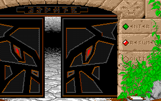

# Firestaff

**Five Dungeon Master games. One engine. Your original data.**

Firestaff is a source-faithful reimplementation of every major Dungeon Master
game engine, built from scratch in portable C for macOS, Windows, Linux and
Steam Deck. It plays your legally owned game files on modern hardware with
pixel-perfect **Original** rendering or selectable **Custom** presentation at
resolutions from 640×400 up to 4K.

[](https://github.com/yeager/firestaff/releases/latest)
[](https://github.com/yeager/firestaff/actions/workflows/verify.yml)
[](LICENSE)
[]()

<p align="center">
  
</p>

## Supported Games

| Game | Platform | Reference Source | Status |
|------|----------|-----------------|--------|
| **Dungeon Master** | DOS PC 3.4 | ReDMCSB | Playable, source-locked |
| **Chaos Strikes Back** | DOS PC 3.4 | ReDMCSB / CSBWin | Engine complete, hardening |
| **Dungeon Master II: Skullkeep** | DOS | skproject | Engine complete, hardening |
| **DM Nexus** | Sega Saturn | SH-2 disassembly | Parsing and runtime proven |
| **Theron's Quest** | PC Engine | CD analysis | Parsing and runtime proven |

## Screenshots

Only real runtime captures appear here — no mock-ups or placeholder art.

### Dungeon Master

| Original | Custom |
|----------|--------|
|  | Coming soon |

## Why Firestaff?

**Source-faithful, not guesswork.** Every gameplay-critical path is anchored to
the best available reference source code. DM1 and CSB are locked against
ReDMCSB. DM2 is locked against skproject. Nexus and Theron's Quest are verified
through Saturn SH-2 disassembly and PC Engine CD analysis respectively. The
codebase cites original source files and function names in comments so you can
trace any behavior back to its reference.

**Your data, verified.** Firestaff scans your game files by cryptographic hash,
not by filename. Put files anywhere — loose, in ZIPs, in ISO/BIN disc images —
and the scanner finds them. 165+ verified hashes cover original assets across
all five games. Games with missing required data cannot launch; there is no
guessing or silent fallback.

**Two ways to play.** Every game offers pixel-perfect **Original** rendering at
the native resolution and source palette, plus **Custom** presentation modes
with filtered, upscaled and modern targets up to 3840×2160. Custom always runs
on top of the same source-locked engine — it never bypasses collision, timing,
combat or inventory logic.

**Preservation-grade documentation.** 960+ parity-evidence documents, 3,670+
automated tests, and a [comprehensive wiki](https://github.com/yeager/firestaff/wiki)
covering file formats, hardware architecture, and source-reference boundaries
for all five games.

## Quick Start

1. **Download** from [GitHub Releases](https://github.com/yeager/firestaff/releases/latest).
2. **Run once** so the data directory is created.
3. **Drop your game files** anywhere under the data directory.
4. **Launch.** The scanner finds your data and shows which games are ready.

| Platform | Data directory |
|----------|---------------|
| macOS / Linux | `~/.firestaff/data/` |
| Windows | `<install folder>\data\` |

Suggested layout:

```
~/.firestaff/data/
  dm1/
  csb/
  dm2/
  nexus/
  theron/
```

## Download

| Platform | Package |
|----------|---------|
| macOS | DMG and ZIP |
| Windows | Installer and ZIP |
| Linux x86_64 | DEB and RPM |
| Linux ARM64 | DEB and RPM |
| Steam Deck | pacman `.pkg.tar.zst` |

## Game Status

### Dungeon Master (PC 3.4)

Playable and source-locked against ReDMCSB. Viewport rendering, combat, spells,
movement, inventory, Hall of Champions, save/load, title sequence, entrance
animation, music, and HUD are all verified. The strongest runtime target.

### Chaos Strikes Back (PC 3.4)

Full engine coverage: DSA opcode interpreter, monster and world execution,
startup presentation, entrance and credits sequences, HUD and champion panels,
viewport geometry, thing and sensor runtime, combat and movement systems,
original save format and Utility Disk support. End-to-end playability hardening
is active.

### Dungeon Master II: Skullkeep

Source-locked against skproject. GDAT renderer, material families, creature
renderer, map and record runtime, save interop, menu and title, party and
inventory, spells, creature AI and combat, world scripts, and outdoor scenes are
all complete. Active work focuses on remaining real-data passes.

### DM Nexus (Sega Saturn)

Saturn DGN geometry, RLOWFIX.BIN resource archive, ITEM.IBS item definitions,
PRS3 sprite compression, SAL/MAP sound banks, and SDDRVS.TSK sound driver are
all parsed and verified. SH-2 disassembly has proven VDP1/VDP2 register
initialization, SCSP sound communication, FONT012 text rendering, and 19
original IWA source module names extracted from the binary.

### Theron's Quest (PC Engine)

JP and US Track 02 provenance is hash-verified. CD record chain, 218-entry
asset manifest, startup level envelope, and SRM save boundary are proven.
Parser, world state, viewport, mechanics, save/load, and shop-table guards have
focused test coverage.

## Graphics Modes

| Mode | Resolution | Description |
|------|-----------|-------------|
| **Original** | 320×200 | Pixel-faithful rendering at the original cadence and palette |
| **Custom** filtered | 640×400 – 3840×2160 | CRT-style scanlines, palette correction and sharpening |
| **Custom** upscaled | 640×400 – 3840×2160 | Clean modern output preserving the original look |
| **Custom** modern | 640×400 – 3840×2160 | New art and UI experiments |

## Command-Line Options

```
firestaff [options]
  --game <id>           Pre-select dm1, csb, dm2, nexus or theron
  --scale-mode <n>      1=Original, 2=Custom enhanced, 3=Custom modern
  --data-dir <path>     Game-data root directory
  --scan-data           Scan and report found/missing game files
  --fullscreen          Run fullscreen
  --no-vsync            Disable vertical sync
  --fps                 Show FPS counter
  --duration <ms>       Run for a fixed duration (-1 = run until exit)
  --width <px>          Window width
  --height <px>         Window height
  --script <cmds>       Comma-separated input script
  --version             Print version and exit
  --help, -h            Print help
```

Examples:

```bash
firestaff --scan-data
firestaff --game dm1 --scale-mode 1
firestaff --data-dir ~/Games/DM --fullscreen
```

## Building from Source

Requirements: CMake 3.20+, a C11 compiler, SDL3, Ninja.

```bash
brew install sdl3          # macOS
git clone https://github.com/yeager/firestaff.git
cd firestaff
cmake -S . -B build -DCMAKE_C_COMPILER=cc -G Ninja
ninja -C build
./build/firestaff --help
```

Run the test suite:

```bash
ctest --test-dir build -j4 --output-on-failure
```

Some tests require original game data to pass.

## Architecture

```
Launcher UI (M12)
  └─ Game engine, render loop, input and audio (M11)
       └─ Data layer, dungeon state, combat and timeline (M10)
            └─ Original game files supplied by the player
```

| Directory | Purpose |
|-----------|---------|
| `src/engine/` | SDL3 loop, game view, rendering, input, save/load, audio |
| `src/ui/` | Launcher, menu state, rendering, hit-testing |
| `src/shared/` | Asset loading, hash validation, palette, config, localization |
| `src/frontend/` | Title screens, entrance sequences, boot presentation |
| `src/memory/` | Dungeon, movement, combat, sensors, timeline, savegame model |
| `src/dm1/` | DM1 source-locked runtime |
| `src/csb/` | Chaos Strikes Back runtime |
| `src/dm2/` | Dungeon Master II runtime |
| `src/nexus/` | DM Nexus Saturn runtime |
| `src/theron/` | Theron's Quest runtime |
| `src/dm1v2/` | DM1 Custom presentation |
| `tests/` | 3,670+ integration tests and source-lock gates |
| `parity-evidence/` | 960+ verification documents |

## The Engine in Numbers

| Metric | Count |
|--------|-------|
| Lines of C | 1,190,000+ |
| Source files | 2,425 |
| Headers | 2,379 |
| Test files | 2,919 |
| Automated tests | 3,673 |
| Parity-evidence documents | 960+ |
| Verified game-data hashes | 165+ |
| Localization languages | 19 |

## Source References

- [ReDMCSB](http://dmweb.free.fr/Stuff/ReDMCSB_WIP20210206.7z) — reconstructed C source for DM1 and CSB (PC 3.4)
- [CSBWin](https://github.com/BeipDev/CSBWin) — Chaos Strikes Back reimplementation
- [skproject](https://github.com/gbsphenx/skproject) — reconstructed C source for DM2
- [Greatstone](http://greatstone.free.fr/dm/) — dungeon maps, data notes, graphics atlas
- [DMWeb](http://dmweb.free.fr/) — community documentation, file format specs, tools

## Localization

The launcher supports 19 languages via gettext PO files: English, Swedish,
German, French, Spanish, Italian, Portuguese, Dutch, Polish, Czech, Russian,
Japanese, Korean, Chinese, Danish, Norwegian, Finnish, Hungarian and Turkish.

The game-text pipeline includes 28 hand-drawn Latin Extended-A glyphs and a TTF
font cache with system-font fallback for Cyrillic, Greek, CJK and Hangul.

## Wiki

The [Firestaff Wiki](https://github.com/yeager/firestaff/wiki) has detailed
documentation for users, developers and preservationists:

- Installation, controls, savegames, Steam Deck setup
- Game guides for all five titles
- File format specifications for every supported game
- Technical references and source-lock architecture
- Deep internals: DM1 PC34, CSB DSA, DM2 GDAT, Nexus DGN/PRS3/Saturn hardware, Theron's Quest Track 02
- Preservation worklists for ReDMCSB, CSBWin and skproject

## Legal

Firestaff is a clean-room engine reimplementation. You need original game files
that you legally own. No copyrighted game data is included.

Dungeon Master, Chaos Strikes Back and Dungeon Master II are trademarks of FTL
Games. DM Nexus is a trademark of Victor Interactive Software. Theron's Quest is
a trademark of Working Designs / Victor Interactive Software.

## License

MIT. See [LICENSE](LICENSE).
